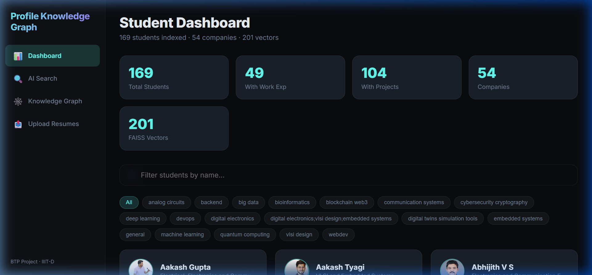
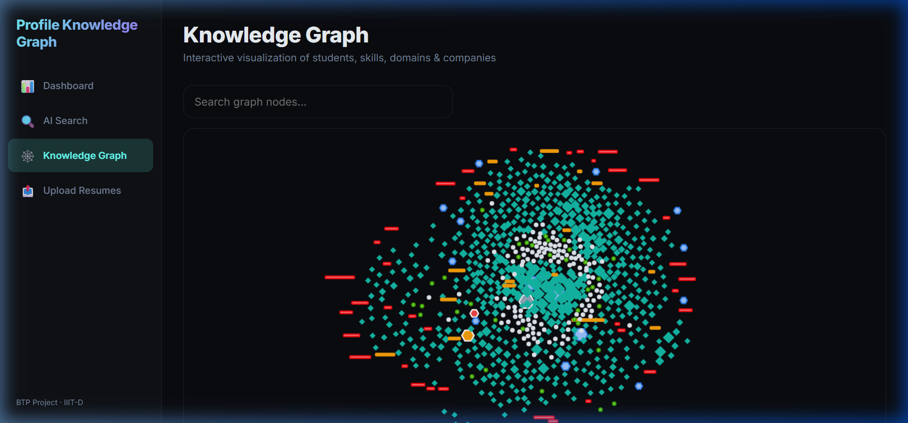

# 📄 Resume Hub — AI-Powered Resume Parsing & Semantic Search Platform

An end-to-end, full-stack platform that ingests student resumes (PDF), extracts structured data using a 5-call AI pipeline, indexes them in a vector database, and enables natural language semantic search with LLM-powered re-ranking.

---

## 📸 Screenshots

### Student Dashboard


### Knowledge Graph


---

## 🏗️ System Architecture

```
┌─────────────────────────────────────────────────────────────────┐
│                        RESUME HUB                               │
├─────────────────────────────────────────────────────────────────┤
│                                                                 │
│  ┌──────────┐    ┌──────────────┐    ┌─────────────────────┐   │
│  │  PDF     │───▶│  5-Call AI   │───▶│  Structured JSON     │   │
│  │  Resume  │    │  Pipeline    │    │  (output/*.json)     │   │
│  └──────────┘    │  (Bedrock)   │    └─────────┬───────────┘   │
│                  └──────────────┘              │               │
│                                                ▼               │
│                  ┌──────────────┐    ┌─────────────────────┐   │
│                  │  Titan V2    │───▶│  FAISS Vector Index  │   │
│                  │  Embeddings  │    │  (resume_index.faiss)│   │
│                  └──────────────┘    └─────────┬───────────┘   │
│                                                │               │
│  ┌──────────┐    ┌──────────────┐    ┌─────────▼───────────┐   │
│  │  User    │───▶│  FastAPI     │───▶│  Semantic Search     │   │
│  │  Query   │    │  Backend     │    │  + LLM Re-Ranking    │   │
│  └──────────┘    └──────────────┘    └─────────────────────┘   │
│                                                                 │
│  ┌──────────────────────────────────────────────────────────┐   │
│  │  React Frontend (Vite) — Dashboard, Search, Graph View   │   │
│  └──────────────────────────────────────────────────────────┘   │
└─────────────────────────────────────────────────────────────────┘
```

---

## 📊 Current Dataset

| Metric | Count |
|:---|:---|
| **Total PDFs Processed** | 154 |
| **Rich JSON Profiles** | 154 |
| **FAISS Index Vectors** | 201 (154 rich + 47 manual-only) |
| **Unique Students** | ~169 (after deduplication) |
| **Companies Represented** | 54 |
| **Students with Projects** | 104 |
| **Skill Domains Tracked** | 30 |

---

## 🛠️ Technology Stack

| Layer | Technology |
|:---|:---|
| **Backend** | Python 3.11, FastAPI, Uvicorn |
| **Frontend** | React 18 (Vite), Vis.js (Knowledge Graph), CSS (Glassmorphism) |
| **AI — Parsing** | AWS Bedrock → Amazon Nova Micro (5-call structured extraction) |
| **AI — Embeddings** | AWS Bedrock → Amazon Titan Text Embeddings V2 (1024-dim) |
| **AI — Search Re-Ranking** | AWS Bedrock → Claude 3.5 Sonnet / Nova Micro |
| **Vector DB** | FAISS (IndexFlatIP — cosine similarity) |
| **Containerization** | Docker (multi-stage build), Docker Compose |

---

## 🚀 Quick Start

### Prerequisites
- Python 3.11+
- Node.js 18+ (for frontend dev)
- Docker & Docker Compose (for containerized deployment)
- AWS Account with Bedrock access (Titan Embeddings V2, Nova Micro, Claude 3.5)

### 1. Environment Setup

Create a `.env` file in the project root:

```env
AWS_ACCESS_KEY_ID=your_access_key
AWS_SECRET_ACCESS_KEY=your_secret_key
AWS_DEFAULT_REGION=ap-southeast-2
```

### 2. Install Dependencies

```bash
pip install -r requirements.txt
```

### 3. Run Locally

**Backend only:**
```bash
python -m uvicorn backend.main:app --host 0.0.0.0 --port 8001 --reload
```

**Frontend (dev mode):**
```bash
cd frontend
npm install
npm run dev
```

**Both together (production — serves React from FastAPI):**
```bash
cd frontend && npm run build && cd ..
python -m uvicorn backend.main:app --host 0.0.0.0 --port 8001
```
Then open `http://localhost:8001`.

---

## 🐳 Docker Deployment

### Build & Run

```bash
docker compose up --build -d
```

This performs a **multi-stage build**:
1. **Stage 1**: Compiles the React frontend into static assets (`frontend/dist/`)
2. **Stage 2**: Sets up the Python runtime, installs dependencies, copies data assets and the built frontend, then starts FastAPI on port **8001**

### Verify

```bash
curl http://localhost:8001/api/health
# Expected: {"status":"ok","students":169,"index_exists":true}
```

### Stop

```bash
docker compose down
```

### Volume Mounts
The `docker-compose.yml` mounts the following directories so data persists between container restarts:
- `./output` — Parsed JSON profiles
- `./manual_text` — LinkedIn-exported profiles
- `./linkedin_pdfs` — Source PDF files
- `./Resumes` — Additional uploaded resumes
- `./photos` — Student photos
- `./resume_index.faiss` — Vector index
- `./resume_metadata.json` — Index metadata

---

## 📋 Data Processing Pipeline

### Step 1: Parse Resumes (5-Call AI Pipeline)

```bash
python resume_parser.py --input_dir linkedin_pdfs --output_dir output
```

Each PDF goes through **5 sequential AI calls** via AWS Bedrock:

| Call | Purpose | Fields Extracted |
|:---|:---|:---|
| **1/5** | Basic Info | Name, email, phone, GitHub, LinkedIn, branch, CGPA |
| **2/5** | Education | Degrees (UG/PG/PhD), awards, certifications, POR |
| **3/5** | Marks & Ranks | 10th/12th scores, JEE/GATE ranks |
| **4/5** | Experience | Projects (×5), research (×3), work (×4), papers (×3) |
| **5/5** | Scoring | 30 skill scores (0-10), domain classification, tool aggregation |

- **Rate**: ~1 resume/minute (due to throttling retries)
- **Skip logic**: Already-processed PDFs are automatically skipped
- **Auto-indexing**: Each parsed resume is immediately embedded and added to FAISS

### Step 2: Merge Manual LinkedIn Data

```bash
python merge_manual.py
```

Merges supplementary data (skills, courses, projects) from `manual_text/` into the rich `output/` JSONs where a name match exists.

### Step 3: Build/Rebuild FAISS Index

```bash
python resume_indexer.py
```

- Reads all JSONs from `output/` and `manual_text/`
- Distills each to a token-efficient text blob
- Generates 1024-dim embeddings via Amazon Titan V2
- Builds a FAISS IndexFlatIP (cosine similarity after L2 normalization)
- Deduplicates by student name (`output/` takes priority over `manual_text/`)
- Saves `resume_index.faiss` + `resume_metadata.json`

### Full Refresh (Nuclear Option)

```bash
# Delete old index
rm resume_index.faiss resume_metadata.json

# Re-parse all PDFs (skips existing JSONs)
python resume_parser.py --input_dir linkedin_pdfs --output_dir output
python resume_parser.py --input_dir Resumes --output_dir output

# Merge and re-index
python merge_manual.py
python resume_indexer.py
```

---

## 🔍 Search System

### How It Works

1. **Query Embedding**: User's natural language query is embedded using Titan V2
2. **Vector Search**: FAISS finds the top N candidates by cosine similarity
3. **LLM Re-Ranking**: Claude reads the distilled profiles and re-ranks based on actual fit
4. **Response**: Returns ranked candidates with AI-generated reasoning

### CLI Search

```bash
# Full search with AI reasoning
python resume_search.py "VLSI design engineer with FPGA experience" --top 5

# Raw vector results only (no LLM cost)
python resume_search.py "machine learning with NLP" --top 10 --skip-llm
```

### API Search

```bash
curl -X POST http://localhost:8001/api/search \
  -H "Content-Type: application/json" \
  -d '{"query": "deep learning engineer", "top": 5}'
```

---

## 🌐 API Endpoints

| Method | Endpoint | Description |
|:---|:---|:---|
| `GET` | `/api/health` | System health check (student count, index status) |
| `GET` | `/api/students` | List all student profiles (without raw_data) |
| `GET` | `/api/students/{name}` | Get single student profile by name |
| `GET` | `/api/photos/{filename}` | Serve a student photo |
| `POST` | `/api/search` | Semantic search with optional LLM re-ranking |
| `POST` | `/api/upload` | Upload PDF resumes for parsing |
| `GET` | `/api/graph` | Knowledge graph data (nodes + edges) |
| `GET` | `/api/stats` | Aggregate statistics and domain distribution |

### Search Request Body
```json
{
  "query": "web developer with React and Node.js experience",
  "top": 5,
  "skip_llm": false
}
```

### Search Response
```json
{
  "candidates": [
    {
      "name": "Student Name",
      "score": 0.87,
      "primary_domain": "webdev",
      "branch": "CSE",
      "cgpa": 8.5,
      "distilled": "...",
      "photo_url": "/api/photos/Student Name.jpg"
    }
  ],
  "ai_analysis": "1. **Student Name** — Strong fit because..."
}
```

---

## 📁 Project Structure

```
final/
├── backend/
│   └── main.py              # FastAPI server (endpoints, search, graph)
├── frontend/
│   ├── src/                  # React source code
│   └── dist/                 # Built static assets (production)
├── output/                   # 154 richly-parsed JSON profiles
├── manual_text/              # 146 LinkedIn-exported JSON profiles
├── linkedin_pdfs/            # 145 source PDF resumes
├── Resumes/                  # 9 additional PDF resumes
├── photos/                   # Student profile photos
├── resume_parser.py          # 5-call AI parsing pipeline
├── resume_indexer.py         # FAISS index builder
├── resume_search.py          # CLI semantic search tool
├── merge_manual.py           # Merge LinkedIn data into rich profiles
├── resume_index.faiss        # FAISS vector index (201 vectors)
├── resume_metadata.json      # Index metadata with distilled profiles
├── requirements.txt          # Python dependencies
├── Dockerfile                # Multi-stage Docker build
├── docker-compose.yml        # Docker Compose config
├── render.yaml               # Render.com deployment blueprint
├── deploy.sh                 # EC2 deployment script
├── .env                      # AWS credentials (DO NOT COMMIT)
└── README.md                 # This file
```

---

## 🔧 Configuration

### Bedrock Models Used

| Purpose | Model ID | Region |
|:---|:---|:---|
| Resume Parsing | `amazon.nova-micro-v1:0` | ap-southeast-2 |
| Embeddings | `amazon.titan-embed-text-v2:0` | ap-southeast-2 |
| Search Re-Ranking | `apac.anthropic.claude-3-5-sonnet-20241022-v2:0` | ap-southeast-2 |
| Search (CLI) | `amazon.nova-micro-v1:0` | ap-southeast-2 |

### Skill Categories Scored (30 domains)

`webdev`, `frontend`, `backend`, `mobile_dev`, `app_dev`, `cloud`, `devops`, `data_science`, `machine_learning`, `deep_learning`, `reinforcement_learning`, `computer_vision`, `nlp`, `cybersecurity_cryptography`, `blockchain_web3`, `bioinformatics`, `ar_vr`, `robotics_automation`, `big_data`, `digital_electronics`, `analog_circuits`, `vlsi_design`, `embedded_systems`, `signal_processing`, `control_systems`, `iot`, `communication_systems`, `power_systems_power_electronics`, `quantum_computing`, `digital_twins_simulation_tools`

---

## 🔒 Security Notes

- **`.env` file**: Contains AWS credentials — **never commit to Git**
- **CORS**: Currently set to `allow_origins=["*"]` — restrict in production
- **No authentication**: Current version is for internal/demo use

---

## 📈 Future Improvements

- **Persistent Vector DB**: Migrate from local FAISS to Pinecone/Weaviate for production scale
- **Authentication**: Add Firebase/Clerk for multi-tenant access
- **Batch Processing**: Parallelize the 5-call pipeline for faster bulk parsing
- **CI/CD**: GitHub Actions for auto-deploy on push
- **Monitoring**: Add CloudWatch metrics for Bedrock API usage tracking

---

**Built with** ❤️ **using AWS Bedrock, FastAPI, React, and FAISS**
